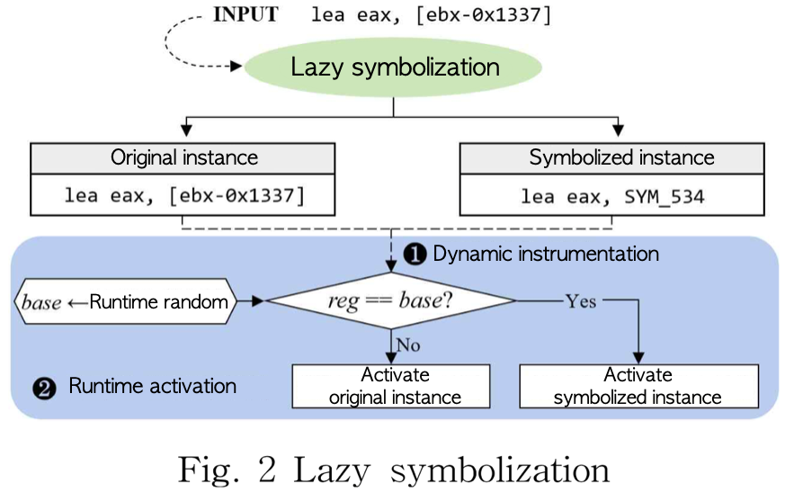
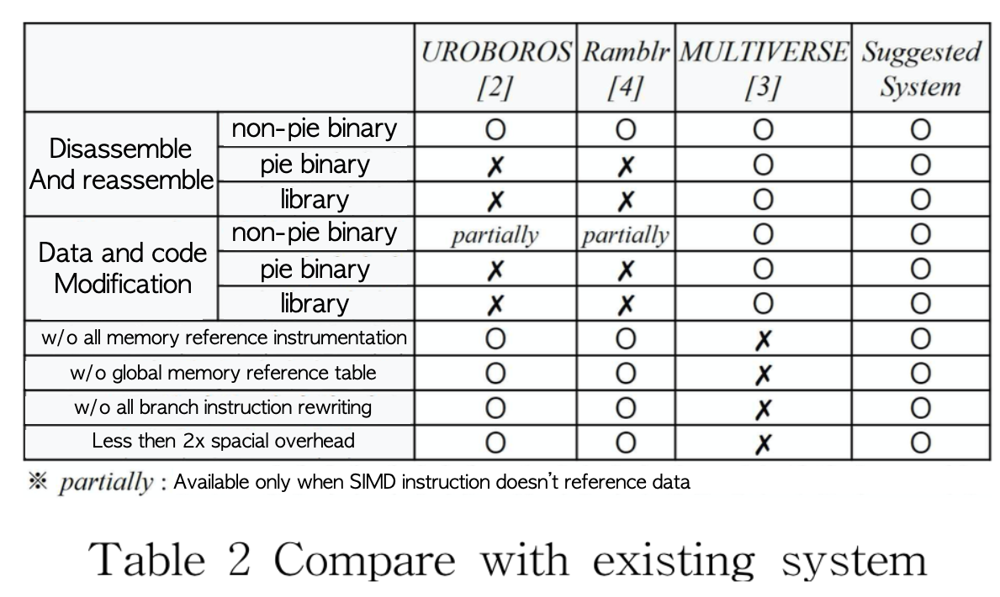

# Reassemblabla
Disassembler creates the reassemblable disassembly  
**100% correctness** in reassemble experiment on Coreutils binaries. 

   
 

## How to use it

    $ python Reassemblablabla_x86.py --file <Binary name> --align
    
Above command creates reassemblable disassembly file.  
We highly recommend to use `--align` option which aligns datas since data-aliment instruction exists in general binaries.  
(Once those instruction is called with non-aligned data, program crashes)
  
    $ python Reassemblablabla_x86.py --file <Binary name> --align --comment
`--comment` option appends original bytepattern as a commant in the output disassembly.   
  
   
 

## Result
Reassemblabla runs, and finally below messages appears on shell.  

    ...
    ...
    
    ...done!
    [*] input binary   : mytest
    [+] assembly file  : mytest_reassemblable.s
    [+] compile script : mytest_compile.sh

below two file is created after running it.    
- `mytest_reassemblable.s` : reassemblable disassembly file
- `mytest_compile.sh`       : compile script used to compile above disassembly file. 

 
   

## Let's Reassemble!
    $ ./mytest_compile.sh
Once you run compile script emit from Reassemblabla, output binary compiled.  

 
 

## Technical deatils
### Lazy symbilization 
Reassemblabla uses our novel idea *Lazy symbolization*. In which symbolizationdeferred until runtime.  
Click [Paper(Kor)](/paper/On-designing-an-efficient-binary-reassembler.pdf)(Best paper in KISC 2018)to see more technical details.  
 

 
Below table compares our *Reassemblabla* with existing tools.  
  

 
 
 
...We're happy to discuss about our tools and technology.   

If you'd like to co-work with us, feel free to contact [Here](https://www.linkedin.com/in/jiwonchoi-dev/).  
